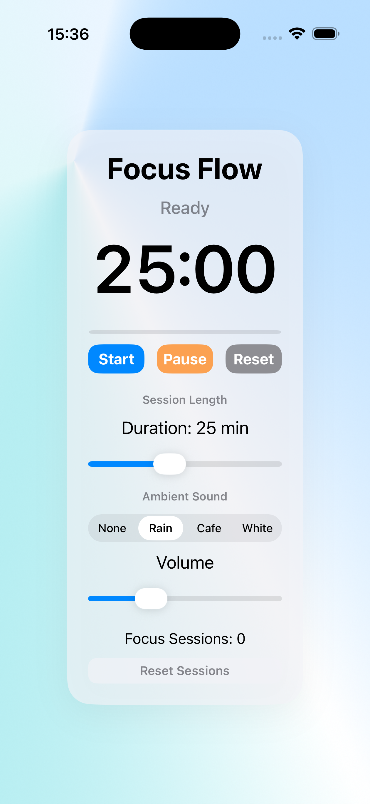
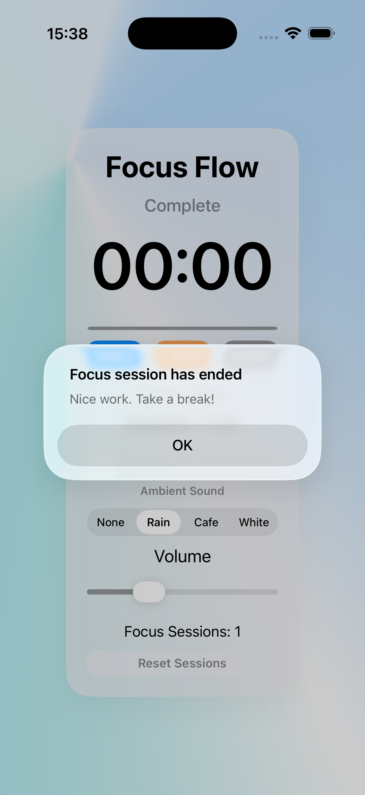

# FocusFlow

FocusFlow is a simple iOS focus timer app built with Swift and UIKit. It helps users run timed focus sessions with ambient background sounds, completion feedback, saved preferences, and basic session tracking.

The app is designed as a clean, lightweight productivity tool with a calm visual style, responsive layout, and a focused single-screen experience.

## Features

- Custom focus timer with adjustable duration
- Start, pause, resume, and reset controls
- Ambient sound options:
  - None
  - Rain
  - Cafe
  - White noise
- Volume control for ambient audio
- Completion sound when a focus session ends
- Completion alert
- Focus session counter
- Reset sessions confirmation alert
- Saved user preferences using UserDefaults
- Responsive layout for different iPhone sizes
- Gradient background and translucent card-style interface

## Tech Stack

- Swift
- UIKit
- Storyboard
- Auto Layout
- AVFoundation
- UserDefaults

## Screenshots





## Requirements

* Xcode
* iOS Simulator or physical iPhone
* iOS 15 or later recommended

## Getting Started

1. Clone the repository:

```bash
git clone https://github.com/philip2012/FocusFlow.git
```

2. Open the project in Xcode:

```bash
open FocusFlow.xcodeproj
```

3. Select an iPhone simulator.

4. Build and run the app.

## How to Use

1. Choose a focus duration using the duration slider.
2. Select an ambient sound if desired.
3. Adjust the volume slider.
4. Tap **Start** to begin the focus session.
5. Use **Pause** to pause the countdown.
6. Tap **Start** again to resume.
7. Tap **Reset** to return to the selected duration.
8. When the timer finishes, FocusFlow plays a completion sound, shows an alert, and increments the focus session counter.

## Saved Settings

FocusFlow saves the following settings between app launches:

* Selected duration
* Selected ambient sound
* Volume level
* Completed focus sessions count

The app uses `UserDefaults` for lightweight local persistence.

## Audio

FocusFlow uses `AVFoundation` for audio playback.

Ambient audio loops during the focus session. The completion sound plays once when the timer reaches zero.

Expected audio files:

```text
rain.mp3
cafe.mp3
white.mp3
complete.mp3
```

These files should be included in the Xcode project target membership.

## Layout and UI

FocusFlow uses a Storyboard-based interface with programmatic layout tuning.

The UI includes:

* A soft gradient background
* A translucent rounded content card
* A large timer display
* Primary timer controls
* Sectioned settings for session length, ambient sound, and volume
* A secondary reset sessions control

The layout is tested on small and large iPhone screens, including iPhone SE and iPhone Pro Max sizes.

## Project Structure

The main app logic is currently handled in `ViewController.swift`.

Key responsibilities include:

* Timer state management
* UI state updates
* Button handling through IBActions
* Audio playback
* UserDefaults persistence
* Session counter logic
* Alert presentation
* Visual styling
* Programmatic layout behavior

## Current Status

FocusFlow is functional and includes the main features expected from a small focus timer app.

Completed:

* Timer logic
* Ambient sound playback
* Completion sound
* UserDefaults persistence
* Session counter
* Reset sessions confirmation
* Responsive layout
* Visual UI redesign

## Future Improvements

Possible future improvements:

* Daily session tracking
* Total focus minutes tracking
* Preset duration buttons
* Dark mode-specific visual tuning
* Haptic feedback
* Local notifications
* More ambient sound options
* Statistics screen
* App icon and launch screen polish

## Author

Created by Philips Nguyen

## License

This project is currently not licensed. He will add a license before public distribution if needed.